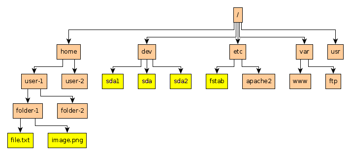

# Linux Operating System
Linux is another kind of Operating system which does the same thing as other operating system,it manages software and hardware resources. Linux is more reliable,secure and it is a open source. Most widely used OS in industry for server hosting, software development and etc

## File structure in Linux
Linux uses th logical filesystem,At the very top of the filesystem structure is /, often referred to as the root of the filesystem, as if it were an upside-down tree

|Filesystem                 |Description                                        
|`bin`                      |Executables that are required to run OS                
|`root`                     |Home directory for the root user
|`boot`                     |Bootloader files to boot linux
|`dev`                      |devices that send/receive data sequentially (printers/mice); devices that are block-oriented (HDs, flash drives)
|`etc`                      |Text based config file used by the system
|`home`                     |Home folders for the users, every users will have their own home folder
|`lib`->usr/lib             |Code libraries for the programs in bin or sbin
|`mnt`                      |To mount external devices
|`opt`                      |Contains files for the program that you can install manually
|`sbin`                     |Mgmnt and config files
|`srv`                      |Services like httpd save their files 
|`sys`                      |Hardware within the system
|`tmp`                      |Temporary files 
|`usr`                      |Application files
|`var`                      |Linux variable data and log files

    
