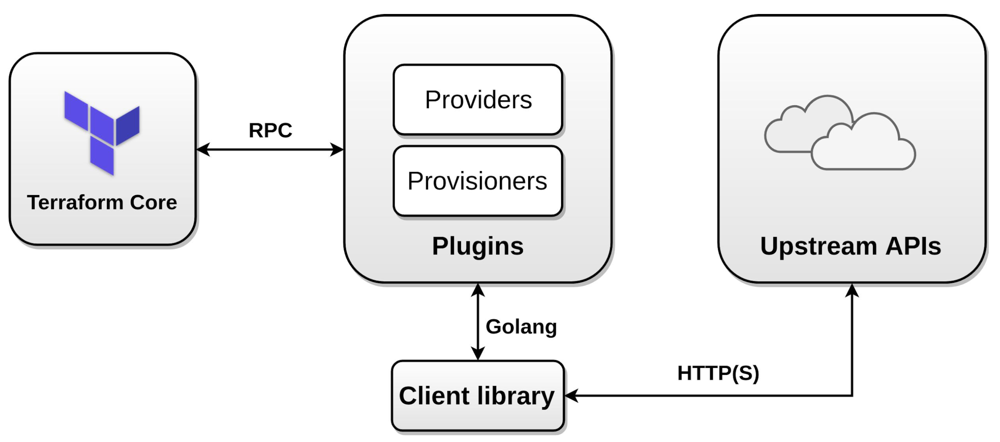

# Terraform

## Infrastructure as Cloud(IaC):

IaC is a infrastructure management tool that helps you to manage you infrastruture with code rather than going into cloud console and doing things manually. We are using one of the IaC tool called Terraform.

You write a configuration script that automate *Creating,Updating,Deleting* the infrastructure. The lanuguage that we will use to write a terraform script is know as Hashicorp Configuration Language(Hcl). 

Not only for cloud infrastructure you can also manage your on-prem infrastructure using Terraform.

## Some important Iac concepts to know:

#### Popular Iac tools

There are several Iac tools available in the market, each serves it's own purpose,some of the popular Iac tools are 
- Terraform (Use for multi cloud management)
- AWS Cloud Formation (Works only with AWS)
- Azure Resource Manager (ARM) templates (For Azure)
- Deployment Manager (For GCP)

#### What is mean by configuration drift
When the provisoned infrastructure has unexpected confguration change. `For eg :  Cloud engineer has enabled Delete on Termination for the production database`

If you not noticed the configuration drift then you resources in the infra might go down, which is obviously a big problem. 

#### How to Detect the cofiguration drift
- Using AWS Config in AWS 
- Storing state of infra in the Terraform State files
- Respective tools for each and every cloud providers 
- AWS Cloud Formation comes with AWS Drift Detection

#### How to prevent the cofiguration drift
- Using gitops, put your files in the git, makes easy to versioning and review each and every pull request so that you can avoid misconfiguration

## So What is Terraform,
Terraform is the tool helps you to leverage the Infrastructure as Code.Terraform can manage low-level components like compute, storage, and networking resources, as well as high-level components like DNS entries and SaaS features.

## Terraform Architecture
So how does the terraform request works on high level?

1. You write a configuration code, then hit 'terraform apply'
1. Then the request go to the plugins via RPC
1. Then the request will communicate with an API which ever provider you are targeting *for example:AWS*



#### Terraform Provisioners
Provisioners are used to excute the script or commmand in the compute machine after they have created. It is like executing user data script while creating the EC2 instances. 

#### Terraform Providers
Providers are plugins that allow you to interact with API you want. Eg: AWS,Azure,Kubernetes,Postgres,Github etc

You need a provider to make your terraform configuration file work. 

'terraform init' comand will download all the necessary plugin according to the provider you mentioned in the configuration file. 

    *Tip: If you are working in big complex infrastructure and you wanna know which providers they are using just execute the command 'terraform providers'*

#### Terraform Modules

Terraform modules is used to reduce the amount of code in the configuration and reusablility of code. You can relate it to functions or libraries in the programming languages(Not exactly the same to same but both serves the same purpose)

#### Maintaining Terraform Files

##### Variables 
Variables are defined by using variable blocks
``` 
variable "demo"{
    type = string
    default = "Hello world"
}
```
##### Variable Types

String,Numbers,Bool,lists,set,map. We can define a default value
Examples
```
variable "vpc_name"{
    type = string                         #Defining what kind of variable type you are using
    description = "Setting a VPC name"    #Description provides an overview for reader why or what variable is defined here 
    default = "myvpc"                     #Giving your value
}
```
Note: Number or integers don't need double quotes, but Terraform automatically converts number and bool values to strings when needed. For example 5 and "5" both are correct

##### Variable LISTs

List is what an array is doing in the prograaming language, it is use to store multiple values 
```
variable "lists" {
    type = (string)
    default = ["Value1", "Value2"]
}
```
##### VARIABLE MAP

Is a Key:Value pair. We use the key to access to the value

```
variable "mymap" {
    type = map
    default = {
        Key1 = "Value1"
        Key2 = "Value2"
    }
}
```

##### Outputs
Basically outputs block will give you the output after you hit 'terraform apply'
```
output "vpc_id" {
    value = "aws_vpc.myvpc.id"
}

```

If we run a `apply` we can see the next message:

```
Apply complete!
Outputs:
vpcid = vpc-099d9099f5faec2d9
``` 

##### Local values 

Local values assigns tha name to the expression. Basically we are storing the values in the variables and we call or use multiple times in our configuration file 

```
locals {
        my_bike = "Duke250"
}
output "my_bike_model" {
  value = local.my_bike
}
```

Note: Above is just an example to understand for people reading this, in real case scenarios we didn't use random variable like bike.etc. remember we are using terraform to automate the cloud infrastructure 


##### DataSources
Data source is used to alow terraform to use the information outside of terraform, means it used information may be another configuration file or modified functions.

##### Environment variable

Used to export our values and able to overide the values in the .tf file before execute 'terraform plan'. It is more secure way to pass the secret information as variables rather than exposing it in our configuration file

How to do it eg TV_VAR_vpcname=myvpc

##### TFVAR Files

Passing variables inside a file, this is possible create a file called terraform.tfvars this file can be in a yaml or json notation.

Note :  only *terraform.tfvars* file will be autoloaded, if you are using your own naming conversion for multiple tfvar file like *dev.tfvars* *prod.tfvars* these values cannot be auto loaded by terraform. You need to explicitly load via the command line during 'terraform plan'

command to do it ; 'terraform plan -var-file="dev.tfvars"'

##### AUTOLOAD Variables

Similar to terraform.tfvars if you wanna use different file names but you wanna terraform to load that automatically, in such cases you can use *<file_name>.auto.tfvars* (This is the next file that look after terraform.tfvars). 

```
eg: dev.auto.tfvars

```

##### LOAD PRECIDENCE

How your file will be overide the variables

1. -var flag (This will override the '-var-file')
1. -var-file (This will override the 'Environment variables')
1. Environment variables (This will override the values in terraform.tfvars)
1. terraform.tfvars (This will overide the variables in *.auto.tfvars)
1. *.auto.tfvars (This will override the variables in the default code)
1. Default value in the code 

##### Resource Meta Aruguments 

Defines your configuration file behaviour, like saying the terraform to do the things in a way we want 


##### Conditional Expressions

It is if,else statement in the terraform, syntax 'condition ? true_val: false_val'

Syntax explanation:
 - condition refers to what your are going to do (Basically it is the 'if statement')
 - ? (if statement is true) then it takes the 'true_val'
 - : refers to a else
 - if else statement is executed then false_val will be taken

 Note: The return type of if else statement must be same. 

 ##### For Expressions 

 This allows you to iterate over a complex type. It accept input of list,tuple,set,map or an object 

 Syntax : '[for s in var.a : upper(s)]'

 Note : [] -> Returns tuple
        {} -> Returns Object

##### Version Constraints

The `required_version` setting can be used to constrain which versions of the Terraform CLI can be used with your configuration. If the running version of Terraform doesn't match the constraints specified, Terraform will produce an error and exit without taking any further actions.

```
terraform {
  required_version = ">= 0.12"
}

```

The value for `required_version` is a string containing a comma-separated list of constraints. Each constraint is an operator followed by a version number, such as `> 0.12.0`. The following constraint operators are allowed:

-   [`=`](https://www.terraform.io/docs/configuration/terraform.html#) (or no operator): exact version equality
-   [`!=`](https://www.terraform.io/docs/configuration/terraform.html#-1): version not equal
-   [`>`](https://www.terraform.io/docs/configuration/terraform.html#gt-), `>=`, `<`, `<=`: version comparison, where "greater than" is a larger version number
-   [`~>`](https://www.terraform.io/docs/configuration/terraform.html#gt--1): pessimistic constraint operator, constraining both the oldest and newest version allowed. For example, `~> 0.9` is equivalent to `>= 0.9, < 1.0`, and `~> 0.8.4`, is equivalent to `>= 0.8.4, < 0.9`

We can also specified a provider version requirement

```
provider "aws" {
	region = "us-east-1"
	version = ">= 2.9.0"
}

```

##### LOCAL VS REMOTE EXEC

With Terraform the plugins have 2 options to do the job:

-   Local-Exec: From our local machine
-   Remote-Exec: On the remote instance

One example of local-exec is create a ssh key in our machine.

```
resource "null_resource" "generate-sshkey" {
    provisioner "local-exec" {
        command = "yes y | ssh-keygen -b 4096 -t rsa -C 'terraform-vsphere-kubernetes' -N '' -f ${var.virtual_machine_kubernetes_controller.["private_key"]}"
    }
}

```

Another example for local-exec is execute a script for Download Lambda dependencies, and after that, make a zip.

One example for remote-exec is from the key create previously, we can configure on a deployed virtual machine

```
  provisioner "remote-exec" {
    inline = [
      "mv /tmp/authorized_keys /root/.ssh/authorized_keys",
      "chmod 600 /root/.ssh/authorized_keys",
    ]
    connection {
      type          = "${var.virtual_machine_template.["connection_type"]}"
    }
  }

```

##### Terraform State

Stores the current state of the infrastructure which is created by configuration fies,file will be vreated automatically once you hit 'terraform apply'

***file name:terraform.tfstate***

Note: The state file backup will be automatically created and you cannot able to disable the backup. 

#### Terraform Workflow

The workflow will vary in different cases 

Case 1 - Individual 

    - Write: Create a terraform file
    - Plan: Run the terraform plan
    - Create: Run the terraform apply and create the resources 

Case 2 - Team

    - Write: Check the project repo and analyse the current state of the file and pull the file to write or modify the changes 
    - Plan : Run terraform plan and raise the pull request
    - Create: Once merged the resources will be created 

Case 3 -  Terraform Cloud 

    -   Write: Use Terraform Cloud as your `development` environment (statefiles, variables and secrets on Terrafom Cloud)
    -   Plan: When a PR is raised, Terraform Plan is run
    -   Create: Before merging a second plan is run before approval to create

#### Basic Terraform Commands 

##### Terraform init

'terraform init' - intialize the terraform setting inside the project, it basically downloads the necessary providers and settings based on the configuration files

*tip: execute this command then and there while you are working on the project files*

##### Terraform Validate
 'terraform validate' - validate the syntax and aruguments in the terraform configuration file 

##### Terraform FMT
 'terrafomr fmt' - rewrite your terraform files to the standard format

##### Terraform Plan
 'terraform plan' - it was commad that check the current state of already existing remote-state is up to dated, and it basically shows you what gonna change in your cloud resources if you execute the current state of the configuration file, so by seeing this you can able to see what's gonna actually change/create in your environment 

 ##### TERRAFORM APPLY

  `terraform apply` - basically all set lets create a resource. it will create all the resources mentioned in the terraform configuraation file

##### TERRAFORM DESTROY

 `terraform destroy` command is used to destroy the Terraform-managed infrastructure.
